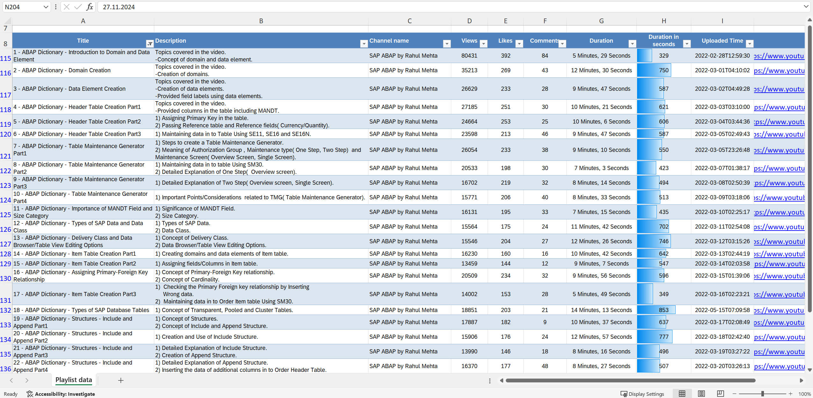

# ABAP Dictionary
This is my practice work for learning ABAP Language concepts : topic of ABAP Dictionary. 
* how to create domains and data elements
* how to create tables using the data elements and domains already created
* how to add a Table Maintenance Generator and add data to database table using SM30 when no access for SE11, SE16 or SE16N
* how to create and use include and append structures to database tables
* how to create a database view, a projection view, a maintenance view and a help view and what is the difference between them
* how to create a secondary index as per the specific performance needs and add it to the database
* how to create an elementary and a collective search help (F4 help)
* how to use an elementary search help in a table with transaction code SE11 and in a program to describe a parameter
* how to create a lock object ( shared/write/enhanced write modes ) with SE11
* how to use a lock object in an ABAP Program and compare the running of a normal write (exclusive lock) against an enhanced write (exclusive lock without cumulation)
* how to work with events associated with the Table Maintenance Generator (SE11 ABAP Dictionary or SE54 Generate Table View )
* how to create primary table with text table for multilanguage support and use the text table in search help creation
* how to create transactions to directly maintain or display tables using SM30
* what is the significance of the case-sensitive checkbox in the domain creation with SE11

## Planning the study work
Feel free to use the Excel Workbook uploaded to this repository

